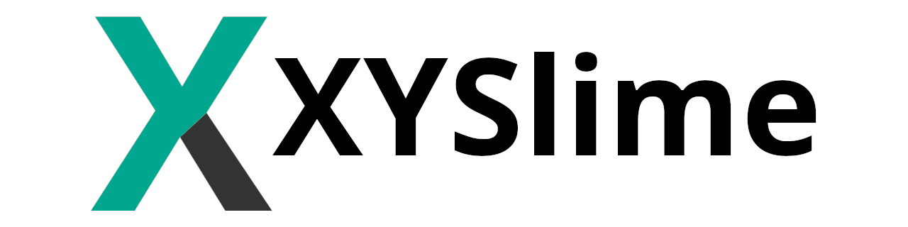

A GitHub Organization with a passion for programming.

## 💬 Our Purpose

We are committed to creating a welcoming and inclusive community where people can learn, share, and grow together.

## 📚 Projects

- [**XYSlime/xasm-community**](https://github.com/XYSlime/xasm-community) A language like [_XASM_](https://github.com/qiaoranMC/XASM_VIRTUAL_CPU_EMULATOR), but with more features and open source.
