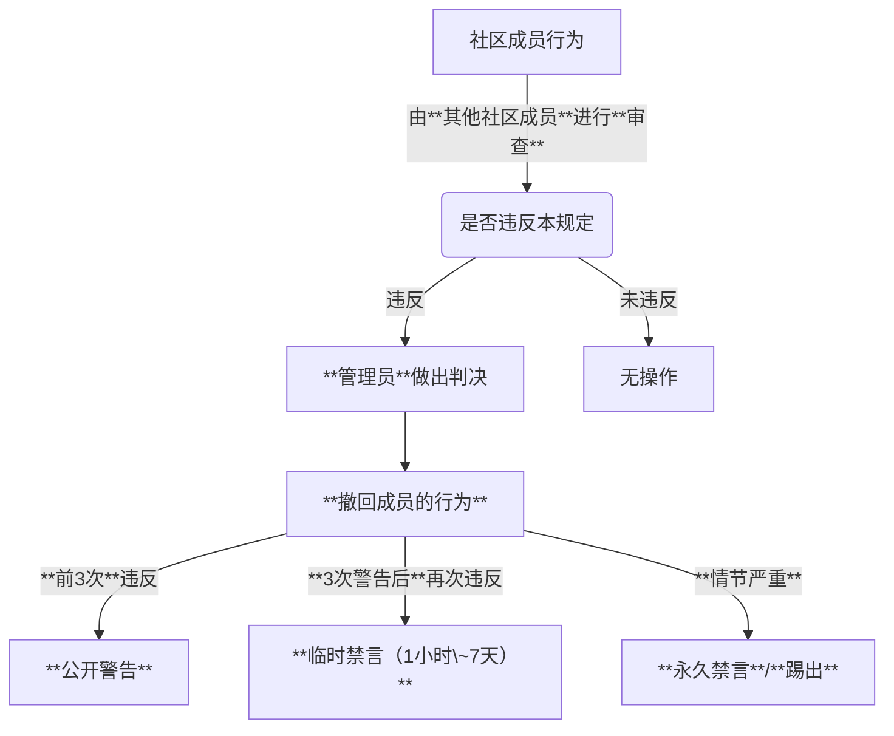

# XYSlime 社区交流规则

**语言:** [**English**](./discuss.md) **简体中文**

## 1. 总则

为了**更好地**管理我们的社区，创建一个**友好**、**和谐**、**文明**的交流环境，我们制定了以下规则。希望所有用户都能遵守，共同维护一个良好的社区氛围。

## 2. 须知

1.  加入本群，即你加入了本社区，则表示你同意遵守本社区规则，如您对本社区规则有异议，请向**社区管理员**提出你的观点，或**自行退出**本社区及群聊。
2.  **其他社区成员**有权对您的行为进行**审查**，如发现您违反了本社区规则，由**管理员**对您进行**警告**、**禁言**、**踢出**等处理。 具体流程如下：

3.  **管理员**需根据**社区规范**、**社区的实际需求**，**客观**、**理性**地管理本社区。
4.  本社区规则会不定时使用**Git**更新和管理，如有任何疑问，请向**管理员**提出。所有行为的**审查**以**最新**的规则为准。
5.  _本社区谢绝谈论任何**政治**、**宗教**、**国家机密**、**个人隐私**等**敏感话题**，如有涉及，**管理员**有权对其行为进行处理。_
6.  _本社区谢绝任何违反 **中华人民共和国** 相关法律的行为。_

## 3. 言论规范

### 3.1 基本原则

1. **尊重他人**：请以礼待人，禁止任何形式的**人身攻击**、**歧视性言论**（包括但不限于针对种族、民族、性别、性取向、宗教信仰、年龄、残疾等的歧视）。
2. **友善交流**：鼓励**积极健康**的讨论，反对**恶意挑衅**、**引战**、**煽动对立**等行为。
3. **内容相关**：发言请尽量**围绕社区主题及相关领域**，避免发布无关内容**刷屏**。

### 3.2 禁止内容

以下内容一经发现，管理员将直接处理，情节严重的将立即踢出：

- **违法信息**：包括但不限于宣传**暴力**、**恐怖主义**、**毒品**、**赌博**、**淫秽色情**等 **中华人民共和国** 法律的内容。
- **隐私泄露**：严禁公开他人个人信息（如电话号码、住址、身份证号等），可以转发聊天记录，但不可转发违反**本规则**的聊天记录。
- **垃圾广告**：**未经允许** 禁止发布 **_商业广告_**、**_推广链接_**、**_二维码_**、**_付费服务_** 等。
- **恶意行为**：包括但不限于**刷屏**、发布**大量无意义内容**、恶意 _`@他人`_ 、**冒充他人或管理员**。
- **不实信息**：禁止 **故意散播谣言**、**虚假信息**或**未经证实的社会事件**。
- **敏感话题**：严禁 **讨论政治**、**宗教**、**国家机密** 等 **敏感话题**。

### 3.3 版权与原创

1. 转载他人内容时请**注明出处**，尽可能获得**原作者授权**。
2. 禁止大肆传播**任何形式**的**盗版软件**、**资源**、**破解工具**等侵犯知识产权的内容，有条件的尽量支持**正版**。
3. 鼓励**原创内容分享**，**优质原创内容**可能会获得管理员**推荐**。

### 3.4 执行细则

1. 管理员根据违规严重程度采取**阶梯式处理**：
   - 轻度违规（前3次违反）：**撤销行为**+**公开警告**
   - 一般违规（3次后，再违反）：**撤销行为**+**临时禁言（1小时~7 天）**
   - 严重违规（情节严重）：**撤销行为**+**永久禁言**/**踢出**
2. 对处理结果有**异议**可在 24 小时内**向管理员团队申诉**
3. 所有处理决定均**以社区整体利益**为**考量依据**

---

_最后更新日期：2025 年 8 月 30 日_  
_本规则最终解释权归 XYSlime 社区管理员团队所有_
